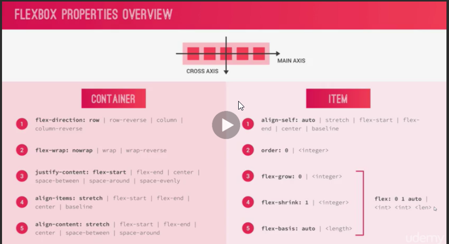

flexbox concepts




### flex contaitner

justify-content: to align items across main-axis

align-items: to align items cross-axis

align-content: for multiple rows

### flex items

align-self:

order:

flex: < flex-grow > < flex-shrink > < flex-basis >

Flex container css
```css
.container{
  display:flex;
  flex-direction:column;
  justify-content:center;
  align-items:center;
}
```

## flexbox basic code
### HTML snippet

```html
<div class="container">
  <div class="item">1</div>
  <div class="item i2">2</div>
  <div class="item i3">3</div>
  <div class="item i4">4</div>
  <div class="item">5</div>
    <div class="item">6</div>  
  <div class="item">7</div>
    <div class="item">8</div>
    <div class="item">9</div>
    <div class="item">10</div>
</div>

```
### CSS Snippet
```css
*{
  margin:0;
  padding:0;
  box-sizing:border-box;
}

.container{
  background-color:#ccc;
  padding:10px;
  height:1000px;
  display:flex;
  /*flex-direction:column;*/
  /*to reverse*/
    flex-direction:row-reverse;
  /*column fills the container*/
    flex-direction:column-reverse;
  /*to centralise the contents*/
    justify-content:center;
  /*to give space equally in between items*/
    justify-content:space-between;
/*give similar(not both equal) left and right space in all items-> */
    justify-content:space-around;
    
/*both equal left & right spaces in all items*/
    justify-content:space-evenly;
  /* by default is flex-start (left/top) you can also make it to right/bottom */
    justify-content:flex-end;
    
  justify-content:space-between;
    
  /* by default its stretch, which mean all elements will be stretched to max item height siz, then we have center,flex-start,flex-end, base-line for text alignment*/
  align-items:center;
  
  /* wrap the items when viewport decreased */
  flex-wrap:wrap;
  
  /*height should be there it be working
  aligns the rows during  flex wrapping*/
  align-content:flex-start;
  
  
}

.item{
  background-color:#f1425d;
  padding:30px;
  margin:5px;
  color:#fff;
  font-size:40px;
  
}
.i2{
  height:200px;
  flex:0 1 300px;
  
}

.i4{
  /* override the align-items in container */
  align-self:flex-end;
  order:-1;
}
.i3{
  order:2;
  flex:3;
}

```


## CSS variables or Custom properties

//definition

--var-name: value;
//Implementation

font-size: var(--var-name);
```css
// to make available to all classes
:root{
    // css variables
--color-primary:#eb2f64;
--color-primary-light: #FF3366;
--color-primary-dark: #BA265D;
    
}  

body {
    font-family: 'Open sans',sans-serif;
    font-weight: 400;
    line-height: 1.6;
    color: var(--color-grey-dark-2);
    background-image: linear-gradient(to right,var(--color-primary-light),var(--color-primary-dark));   
}

```
## flex box basic layout
```css
.content{
display:flex;
}

.sidebar{
    background-color: var(--color-grey-dark-1);
    flex: 0 0 18%; //dont shrink or grow but keep width 18%;
}

.hotel-view{
    background-color: #fff;
    flex:1; // grow as much as it can
}
```

Animation in css
transition: property duration timing-fn delay
```css
transition: transform .2s,
			width .4s cubic-bezier(1,0,0,1) .2s;
```


Z-index
only works if position is mention


margin-auto is powerful in flex box

```css
   //automatically provide space in right side
    &__stars{
       margin-right:auto ;
    }
```

// last of type
.paragraph:not(:last-of-type){
    margin-bottom: 2rem;
}