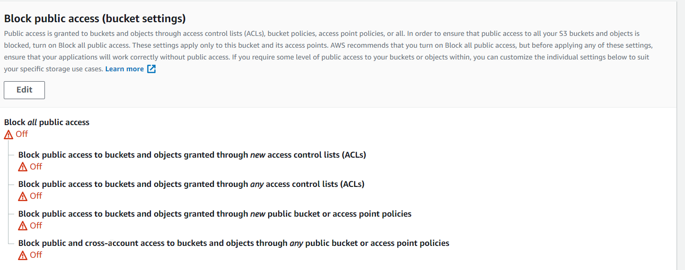
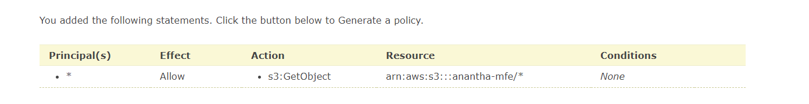
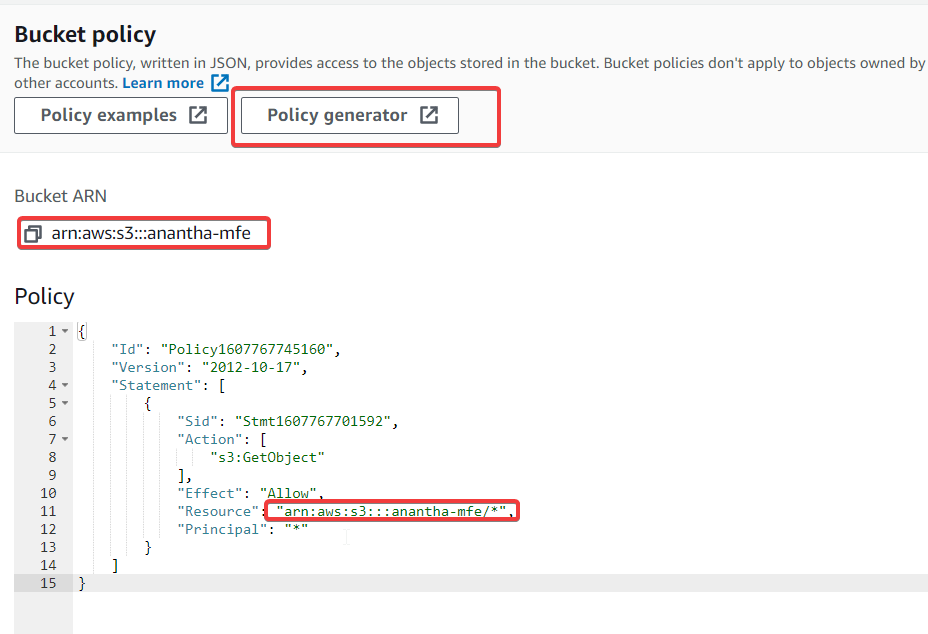
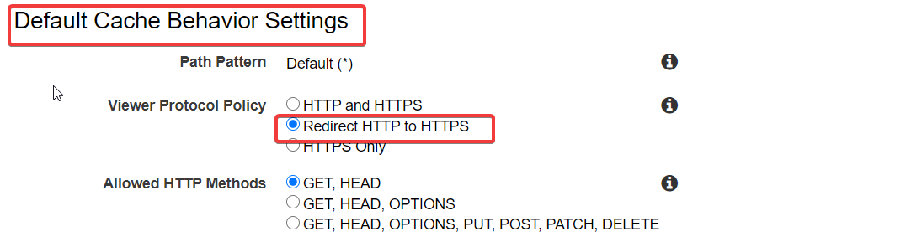
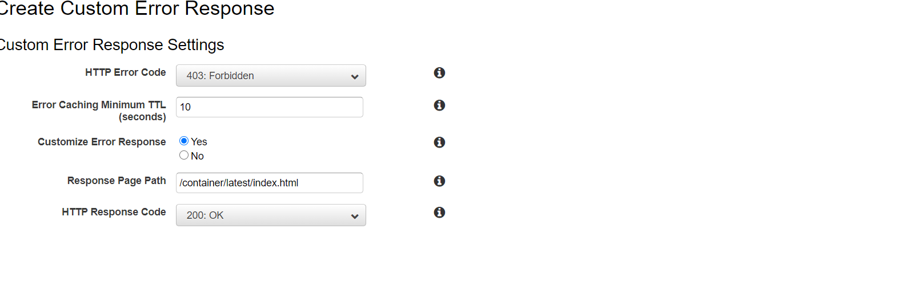
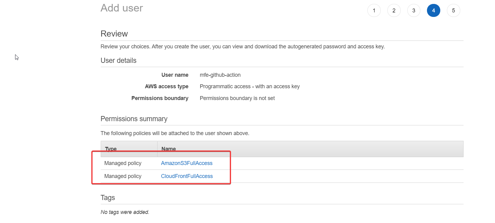
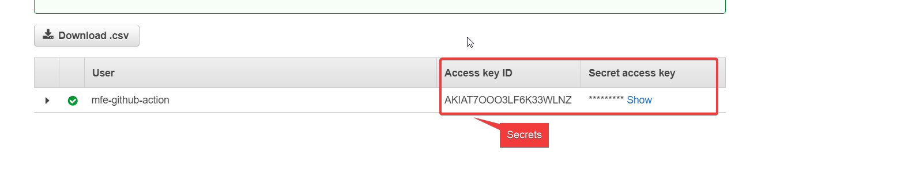
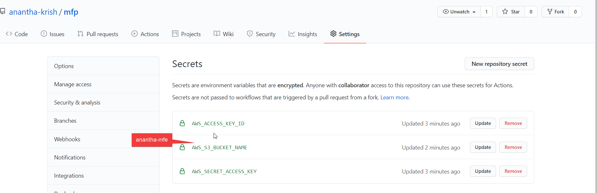
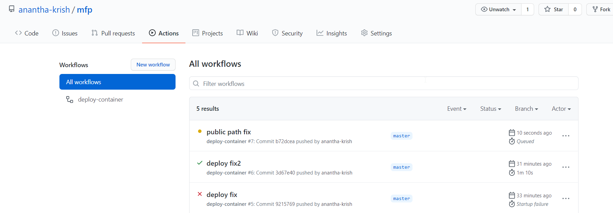
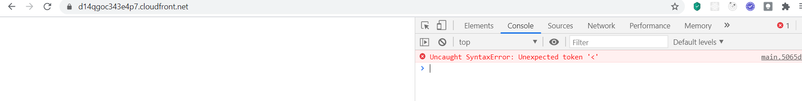

AWS deployment

# Steps
## Bucket Setup
- Search S3 and got S3 menu
- Create a Bucket (unique name)
- Goto Properties> Enable static web hosting
- Goto Permissions> Disable public access Blocking
-
- Edit Bucekt policy using Policy Generator

- Copy the generated JSON & paste in the page ,save it.


## Amazon CDN Setup
- Search for cloudfront
- Click on create distribution
- Select web distribution
- Select the domain Name

- Redirrect HTTP to HTTPS in cache behaviour

- Save the changes & wait the CDN to deploy state
- Goto General tab> Edit  ... set Default Root object as /container/latest/index.html
- Goto Error pages tab

- Create IAM user for access keys with following settings

after pressing create


## Github Secrets Setup
- Goto Settings> Secrets & add 3 secrets

```yaml
      # steps for uploading dist folder to S3
      - uses: chrislennon/action-aws-cli@v1.1
       ## added newly
	   env:
          ACTIONS_ALLOW_UNSECURE_COMMANDS: 'true'
      - run: aws s3 sync dist s3://${{ secrets.AWS_S3_BUCKET_NAME }}/container/latest
        env:
		  ## added newly
          ACTIONS_ALLOW_UNSECURE_COMMANDS: 'true'
          AWS_ACCESS_KEY_ID: ${{ secrets.AWS_ACCESS_KEY_ID}}
          AWS_SECRET_ACCESS_KEY: ${{ secrets.AWS_SECRET_ACCESS_KEY}}
```
after code commit you can see workflow triggered



# Deployment error fix

you may face this error 
as the html is trying  to acess main.js
but our main.js is in container/latest/main.js


this can be fixed by adding public path of webpack.config
```js
   mode:'production',
    output :{
        // contenthash resolves caching issue
      filename: '[name].[contenthash].js',
      //its required while accessing objects from s3
      publicPath: '/container/latest/'
    },

```
commit the change & push, it will be resolved