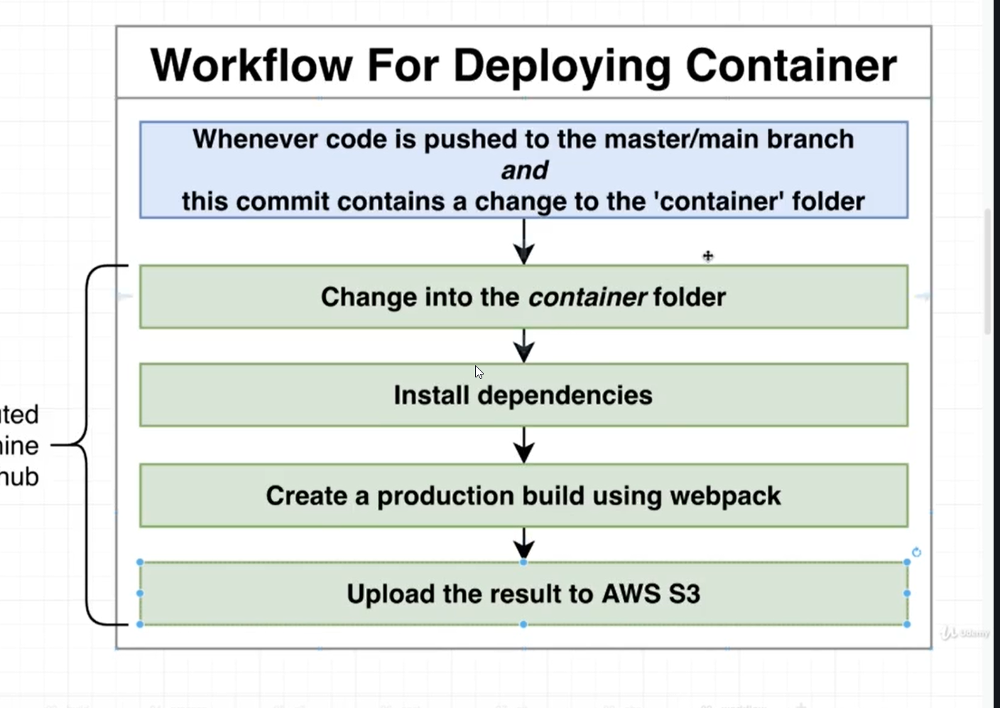
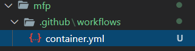

Implementing CI/CD Pipeline

Setting GIT
```js

PS C:\Users\anant> cd D:\MicroFrontends\mfp
PS D:\MicroFrontends\mfp> git init
Initialized empty Git repository in D:/MicroFrontends/mfp/.git/

// after adding .gitignore
PS D:\MicroFrontends\mfp> git status


PS D:\MicroFrontends\mfp> git add .


PS D:\MicroFrontends\mfp> git commit -m "Init commit"

									
PS D:\MicroFrontends\mfp> git remote add origin git@github.com:anantha-krish/mfp.git
									
PS D:\MicroFrontends\mfp> git push origin master

```

# Production config
webpack.prod.js
```js
const {merge} = require('webpack-merge');
const ModuleFederationPlugin = require('webpack/lib/container/ModuleFederationPlugin');
const commonConfig = require('./webpack.common');
const packageJson = require('../package.json');

const domain = process.env.PRODUCTION_DOMAIN;

const prodConfig = {
    // slower but ensure production optimized build
    mode:'production',
    output :{
        // contenthash resolves caching issue
      filename: '[name].[contenthash].js'
    },
    plugins:[
        new ModuleFederationPlugin({
            name:'container',
            remotes: {
                marketing : `marketing@${domain}/marketing/remoteEntry.js`
            },
            shared: packageJson.dependencies
        })
    ]
}


module.exports= merge(commonConfig,prodConfig);
```
webpack.common.config.js
```js
const HtmlWebpackPlugin = require('html-webpack-plugin');
module.exports={
    module:{
        rules:[
            {    //process .mjs & .js file
                test:/\.(js|jsx)$/,
                exclude: /node_modules/,
                use:{
                    loader: 'babel-loader',
                    options:{
                        presets: ['@babel/preset-react','@babel/preset-env'],
                        plugins: ['@babel/plugin-transform-runtime'],
                    }
                }
            }
        ]
    },
    plugins:[
        new HtmlWebpackPlugin({
            template: './public/index.html'
        })
    ]
}
```

- update the scripts in package.json
```json
  "scripts": {
    "start":"webpack serve --config ./config/webpack.dev.js",
	  //newly added
    "build":"webpack --config ./config/webpack.prod.js"
  },
```
# Production config for child projects
marketing/webpack.prod.config.js
```js
const {merge} = require('webpack-merge');
const ModuleFederationPlugin = require('webpack/lib/container/ModuleFederationPlugin');
const commonConfig = require('./webpack.common');
const packageJson = require('../package.json');

const prodConfig = {
    // slower but ensure production optimized build
    mode:'production',
    output :{
        // contenthash resolves caching issue
      filename: '[name].[contenthash].js'
    },
    plugins:[
        new ModuleFederationPlugin({
            name:'marketing',
            filename:'remoteEntry.js',
            exposes:{
                './MarketingApp':'./src/bootstrap.js'
            },
            shared: packageJson.dependencies
        })
    ]
}

module.exports= merge(commonConfig,prodConfig);
```

& add build script in package.json
```json
"build":"webpack --config ./config/webpack.prod.js"
```

# CI/CD pipeline using github Actions



- create a folder inside the parent folder AS
 .github/workflows
 
- create a file for deployment script 

 
 
 ```yml

name: deploy-container

on:
  push:
    branches:
    # list down the braches change
      - master
    paths:
    # detect the project/module change
      - 'container/**'

defaults:
  run:
  # set the pwd to execute the cmd inside the folder
    working-directory: container

jobs:
  build:
    runs-on: ubuntu-latest #virtual machine OS

    steps:
     # download dependencies & build
      - uses: actions/checkout@v2
      - run: npm install
      - run: npm run build
      
      # steps for uploading dist folder to S3
      - uses: chrislennon/action-aws-cli@v1.1
      - run: aws s3 sync dist s3://${{ secrets.AWS_S3_BUCKET_NAME }}/container/latest
        env:
          AWS_ACCESS_KEY_ID: ${{ secrets.AWS_ACCESS_KEY_ID}}
          AWS_SECRET_ACCESS_KEY: ${{ secrets.AWS_SECRET_ACCESS_KEY}}
```

After git commit

like 
```
git add .
git commit -m "secontd commit"
git push origin master
```