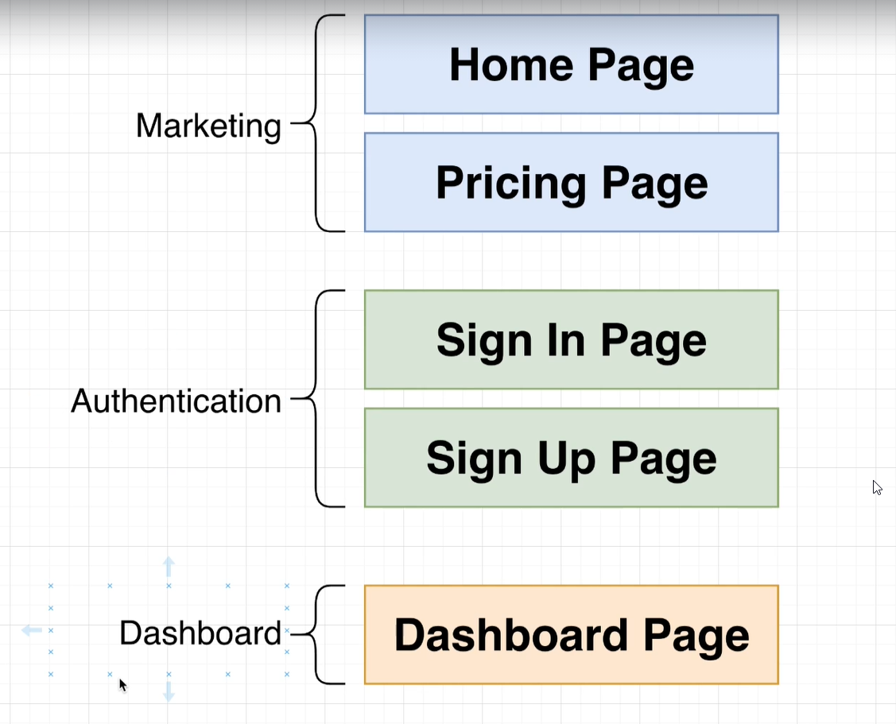
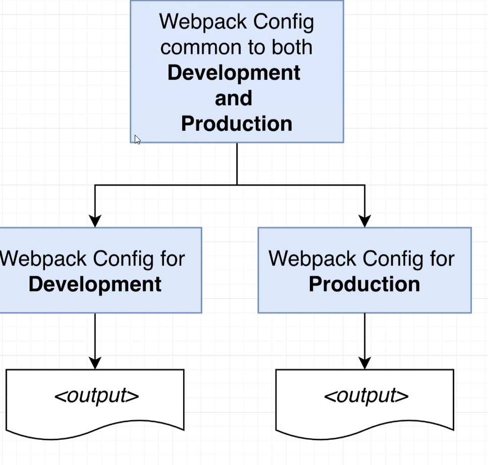
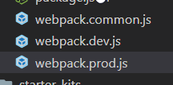

Link Multiple apps

New Project plan


Download the below  file
[mfp.zip](../_resources/92b53851b8f74bbb9feb5d2abac5a79b.zip)

to setup the project.


Why not create create-react-app or vue cli?
Ans: The current webpack of create-react-app **does not provide module federation.**

May be in future they may implement.

## WebPackConfiguration


create three files 



* webpack.common.js
```js
module.exports={
    module:{
        rules:[
            {    //process .mjs & .js file
                test:/\.m?js$/,
                exclude: /node_modules/,
                use:{
                    loader: 'babel-loader',
                    options:{
                        presets: ['@babel/preset-react','@babel/preset-env'],
                        plugins: ['@babel/plugin-transform-runtime'],
                    }
                }
            }
        ]
    }
}
```

* webpack.dev.js
```js
//used to merge configurations
const {merge} = require ('webpack-merge');
const HtmlWebpackPlugin = require('html-webpack-plugin');
const commonConfig = require('./webpack.common');
const devConfig ={
    mode: 'development',
    devServer:{
        port:8081,
        //used for navigation
        historyApiFallback:{
            index:'index.html'
        }
    },
    plugins:[
        new HtmlWebpackPlugin({
            template: './public/index.html'
        })
    ]
}
// mentioning dev config allows to override common conconfig.
module.exports = merge(commonConfig,devConfig)
```

* update package.json of marketting project
```js
  "scripts": {
    "start":"webpack serve --config ./config/webpack.dev.js"
  },
```

# Wiring Up react

- create index & bootstrap file
- import bootstrap in index.js
- Update bootstrap.js
```js
import React from "react"
import ReactDOM from "react-dom";

//or you can render component here
const mount = (el) =>{
    ReactDOM.render(
        <h1>Hi there!!</h1>,el)
}

if( process.env.NODE_ENV === 'development')
{
  const devRoot =  document.querySelector('#_marketing_dev_root');
 if(devRoot)
 {
     mount(devRoot);
 }
}

export {mount};
```
- update index.html
```js
  <title>marketing</title>
</head>
<body>
    <div id="_marketing_dev_root"></div>
</body>
</html>
```

# React Component Mounting Microfrontend
Why we import mount?
We use mount as callback, its even possible to pass react component, but that's not ideal development.

As we need to be tech-stack indepedent in future, in order to use any JS/TS framework.

```jsx
import React, { useEffect, useRef } from "react";
// marketing is configured in webpack
import { mount } from "marketing/MarketingApp";

export default () => {

  // implement logic to mount the MicrofrontEnd when DOM is loaded 
  useEffect(() => {
    // call mount while passing the element
    mount(ref.current);
    
  }, []);
 
  // create reference
  const ref = useRef(null);
  return <div ref={ref}></div>;

};
```

# Shared Dependecy

either mention shared:['react','react-dom'] in all webpacks 

or 
```js
const packageJson = require('../package.json')

    plugins:[
        new ModuleFederationPlugin({
            name:'marketing',
            filename:'remoteEntry.js',
            exposes:{
                './MarketingApp':'./src/bootstrap.js'
            },
            /* Shortcut method to ensure single copy 
            No need to update shared Dependecy list, everytime
            new dependecy is added
            But its better if you can specify the package to share,
            but then you have to update it evrytime new dependency added.
            */
            shared: packageJson.dependencies
        }),
		```
		