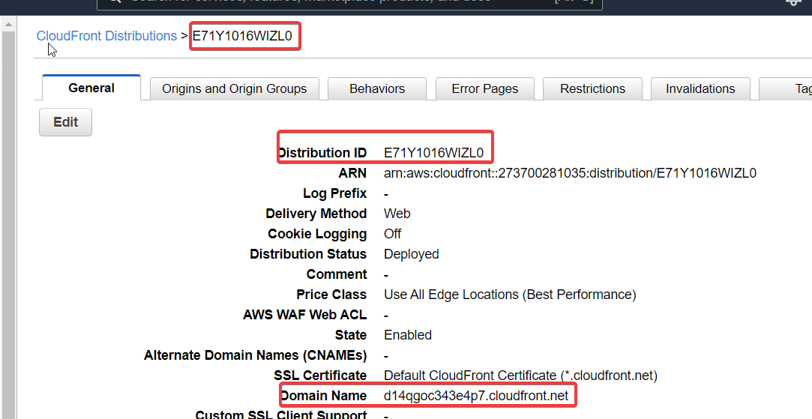
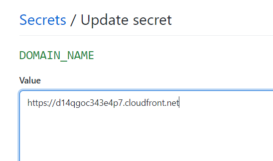

Microfrontend in AWS

# Caching problem
Even though after AWS deployment 
we may not see, latest changes as (CloudFront) CDN delivers the cached version of files.
```yaml
	- uses: chrislennon/action-aws-cli@v1.1
        env:
          ACTIONS_ALLOW_UNSECURE_COMMANDS: 'true'
      - run: aws s3 sync dist s3://${{ secrets.AWS_S3_BUCKET_NAME }}/container/latest
        env:
          ACTIONS_ALLOW_UNSECURE_COMMANDS: 'true'
          AWS_ACCESS_KEY_ID: ${{ secrets.AWS_ACCESS_KEY_ID}}
          AWS_SECRET_ACCESS_KEY: ${{ secrets.AWS_SECRET_ACCESS_KEY}}
          # added for resolving caching issue in cloud front
      - run: aws cloudfront create-invalidation --distribution-id ${{ secrets.AWS_DISTRIBUTION_ID }} --paths "/container/latest/index.html"
        env:
          ACTIONS_ALLOW_UNSECURE_COMMANDS: 'true'
          AWS_ACCESS_KEY_ID: ${{ secrets.AWS_ACCESS_KEY_ID}}
          AWS_SECRET_ACCESS_KEY: ${{ secrets.AWS_SECRET_ACCESS_KEY}}
		  
```		

- After add new secret in github named AWS_DISTRIBUTION_ID which has value of cloud front distribution id;



# Setting Marketing Frontend

- Steps are similar, make a copy of container.yml & name it as marketing
- Replace container keyword with marketing
- And change cache invalidation script
```yaml
      - run: aws cloudfront create-invalidation --distribution-id ${{ secrets.AWS_DISTRIBUTION_ID }} --paths "/marketing/latest/remoteEntry.js"
```
## Important Fixes
1. update container/webpack.config.prod.js
```js
remotes: {
	marketing : `marketing@${domain}/marketing/latest/remoteEntry.js`
}
```

2. Add Publicpath in marketing/webpack.config.prod.js

```js
    output :{
        // contenthash resolves caching issue
      filename: '[name].[contenthash].js',
      publicPath: '/marketing/latest/'
    },
```

3. Add secrets in github for domain.


4. Add environment in workflows/container.yml
```yml
- run: npm run build
	env:
		PRODUCTION_DOMAIN: ${{ secrets.DOMAIN_NAME }}
```