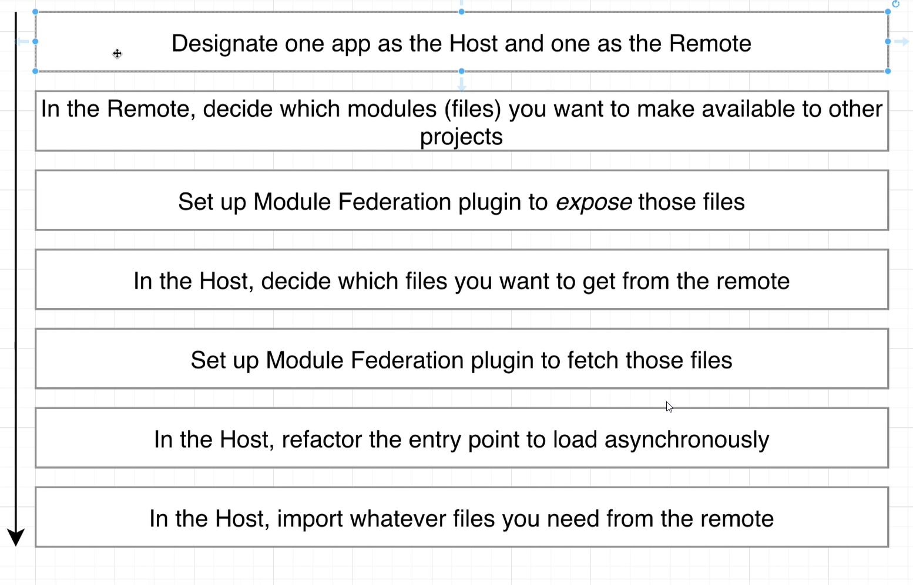
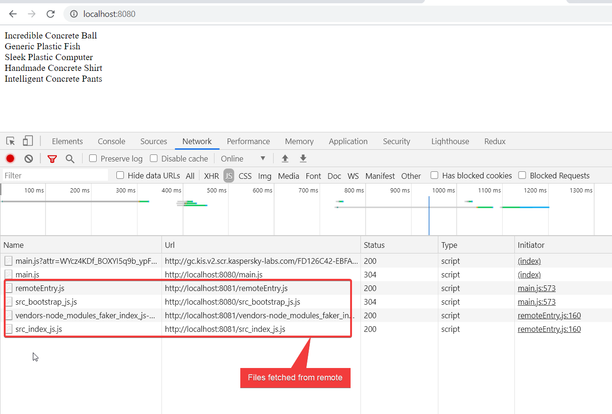

Module Federation

# Module Federation

### Planning



Here host is container & remote is products
## Steps

1. Configure remote webpack
```js 
const HtmlWebpackplugin = require('html-webpack-plugin');
const ModuleFederationPlugin = require('webpack/lib/container/ModuleFederationPlugin');

module.exports = {
    mode: 'development',
    devServer: {
       port: 8081 
    },
    plugins: [
		//newly added
        new ModuleFederationPlugin({
            name:'products',
            filename: 'remoteEntry.js',
            exposes:{
                './ProductsIndex':'./src/index'
            },
        }),

        new HtmlWebpackplugin({
            template:'./public/index.html'
        })
    ]
};
```
3. configure host webpack
```js
const ModuleFederationPlugin = require('webpack/lib/container/ModuleFederationPlugin');

module.exports = {
    mode: 'development',
    devServer:{
        port: 8080
    },
    plugins:[
		//newly addeded
        new ModuleFederationPlugin({
         name:'container',
         remotes:{
             products:'products@http://localhost:8081/remoteEntry.js'
         },import('./bootstrap')
        }),
```
5. Refactor  index.js (bootstrapping)

bootstrap.js
```js
import 'products/ProductsIndex'
console.log('container!!!')
```
index.js
```js
//note here we are using functional import, so that 
//webpack will acquire all required dependencies
import('./bootstrap')
```


7. Import the files & changes ain index.html
```html
<div id="dev-products"></div>
```
output


