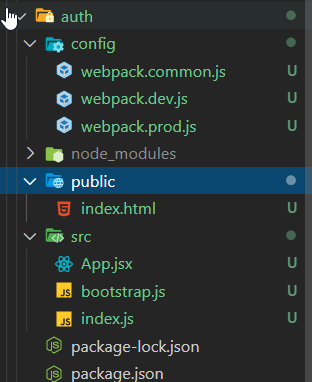
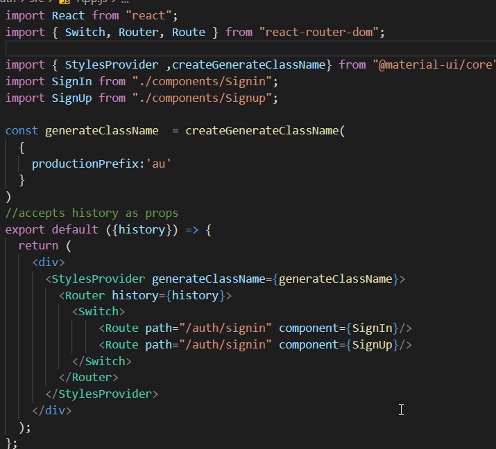

Performance considerations

Copy the folders from marketing to auth.

green colored are copied files from marketing 
- add Signin/Sigup
[components.zip](../_resources/2f4510a49aa4401da97e513ad0a53c6a.zip)
- update App.jsx

- also update webpack config, replace marketing with auth

## Issues in microfrontend with public path
You may see this error in auth project after setting everything

```js
import React from "react";
import { Switch, Router, Route } from "react-router-dom";

import { StylesProvider ,createGenerateClassName} from "@material-ui/core";
import SignIn from "./components/Signin";
import SignUp from "./components/Signup";

const generateClassName  = createGenerateClassName(
  {
    productionPrefix:'au'
  }
)
//accepts history as props
export default ({history}) => {
  return (
    <div>
      <StylesProvider generateClassName={generateClassName}>
        <Router history={history}>
          <Switch>
              <Route path="/auth/signin" component={SignIn}/> 
              <Route path="/auth/signup" component={SignUp}/> 
          </Switch>
        </Router>
      </StylesProvider>
    </div>
  );
};

```

In marketing, we had simple routes like http://localhost:8081/pricing
(thus we never faced error)
But if we add nested error like 
http://localhost:8081/pricing/add


fix:
add public path in dev config of all projects with respective **ports**

```
//auth
const devConfig ={
    mode: 'development',
    output:{
        publicPath: 'http://localhost:8082/'
    },
    devServer:{
        port:8082,
        //used for navigation
        historyApiFallback:{
            index:'index.html'
        }
```		
# inital Location issue
- Its also recommended to pass initial path to child components while mounting

container/src/components/AuthApp.js
```js
  useEffect(() => {
    // call mount while passing the element 
    const { onParentNavigate } = mount(ref.current, {
      // destructioring window.location
      onNavigate: ({ pathname: nextPathname }) => {
        const { pathname } = history.location;
        if (pathname !== nextPathname) {
          history.push(nextPathname);
        }
      },
      initialPath: history.location.pathname
    });
    //listen to the path changes
    if (onParentNavigate) {
      history.listen(onParentNavigate);
    }
  }, []);
```
auth/src/bootstrap.js
```js
const mount = (el, { onNavigate, defaultHistory,initialPath }) => {
    //use browsererhistory in isolation(dev) otherwise use memoryhistory
  const history = defaultHistory || createMemoryHistory(
    {
      initialEntries : [initialPath]
    }
  );

```
## Improve performance using Lazy loading

```js
import React, { lazy, Suspense } from "react";
import Header from "./components/Header.js";
import { BrowserRouter, Route, Switch } from "react-router-dom";
import { StylesProvider, createGenerateClassName } from "@material-ui/core";

const MarketingApp = lazy(() => import("./components/MarketingApp"));

const AuthApp = lazy(() => import("./components/AuthApp"));

const generateClassName = createGenerateClassName({
  productionPrefix: "co",
});

export default () => {
  return (
    <Suspense fallback={<>Loading....</>}>
      <BrowserRouter>
        <StylesProvider generateClassName={generateClassName}>
          <div>
            <Header />
            <Switch>
              <Route path="/auth" component={AuthApp} />
              <Route path="/" component={MarketingApp} />
            </Switch>
          </div>
        </StylesProvider>
      </BrowserRouter>
    </Suspense>
  );
};
```