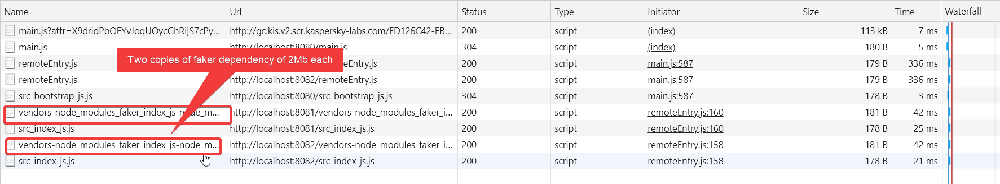
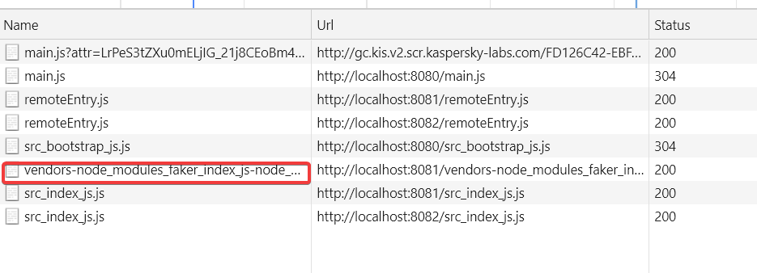
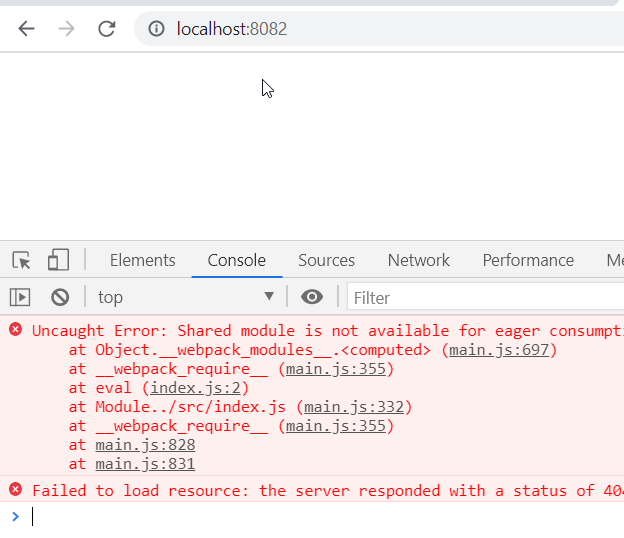

Sharing Depencies

## Problem
* If two projects uses same dependency, we may have replication & huge traffic in network


## Solution
* Share common dependency by updating webpack config

here  cart & product , and restart them.
```js
plugins: [
        new ModuleFederationPlugin({
            name:'products',
            filename: 'remoteEntry.js',
            exposes:{
                './ProductsIndex':'./src/index'
            },
			//newly added
            shared:['faker']
        }),
```
as you can observe only one copy is fetched, 
when **container** app is accessed



but this effects standalone apps,
as **products** & **cart** will get affected 



because we are trying to get shared dependancy asynchronously, the solution is to use **bootstrap approach** ( refract to bootstrap)

example:
### Async Script Loading
**index.js**
```js
import('./bootstrap')
```
**bootstrap.js**
```
import faker from 'faker';
const cartText = `<div> You have ${faker.random.number()} items in your cart </div>`;
document.querySelector('#dev-cart').innerHTML = cartText;
```
above approach enables to webpack to fetch faker before executing the code

**Versioning**

what happens if projects uses same dependency with  different versions?

- Major change: different copies will be provided
      
	  ex: faker@5.1.0 & faker@4.1.0 

- Minor Change: single copy with lowest version will be used
      
	  ex: faker@5.0.0 & faker@5.1.0 (use 5.0.0)
	  
# Development Concerns
The production HTML of container team & development HTML of individualproject may be different.

hence we need to dynamically mount DOM elements.

1. Update bootstrap.js

```js
import faker from 'faker';

const mount = (el) =>{

let products = '';

for(let i=0;i<5;i++)
{
    const name = faker.commerce.productName();
    products += `<div>${name}</div>`;
}
    el.innerHTML = products;
}

if(process.env.NODE_ENV === 'development'){

    const el = document.querySelector('#dev-products');
    if(el){
        mount(el);
    }
}

export {mount};
```

2. Update webpackconfig 

```js
 exposes:{
 './ProductsIndex':'./src/bootstrap'//updated
},
```

3.  update **container** project

* bootstrap.js
```js
import {mount as prodMount} from 'products/ProductsIndex'
import {mount as cartMount} from 'cart/CartShow'

prodMount(document.querySelector('#my-products'))
cartMount(document.querySelector('#my-cart'))
```

* index.html
```js
<body>
    <div id="my-products"></div>
    <div id="my-cart"></div>
</body>
```


# Warning
Dont!! use same name for elements and webpackconfig.
You will get an error

if there **id="cart" & name:'cart'** in webpackconfig, there will be error.