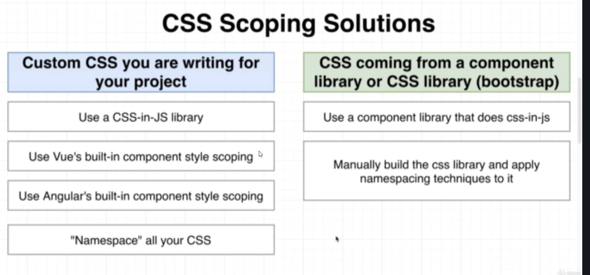
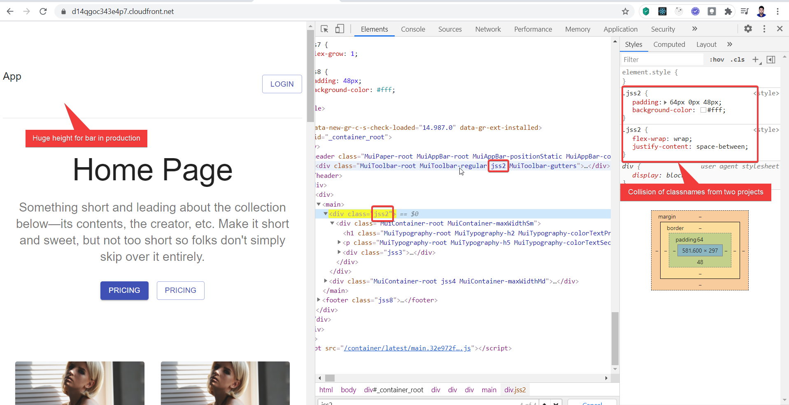

Handling CSS

# Microfrontend CSS issue
Possibility of being styles overridden by different projects, which can result in color,fontsize due to differenet CSS libraries or versions used.


## Solution
Introduce CSS Scoping


Namespace approach is the traditional one & has been used populary, but it still introduces complexity & maintainability issues.

Thus using CSS-in-JS libraries are preferred.

# The reason of our bug
While convering to production build, the classname is changed to shorter names
(ex: class="hero-content" -> class="jss1")

It may cause name collision with other project,
hence we need to resolve it by adding a unique prefix.


## Solution
give a unique classname prefix in each project,
in App.jsx of each project

```js
//marketing/src/App.jsx
import { StylesProvider ,createGenerateClassName} from "@material-ui/core";

const generateClassName  = createGenerateClassName(
  { // unique prefix
    productionPrefix:'ma'
  }
)

export default () => {
  return (
    <div>
      <StylesProvider generateClassName={generateClassName}>
```
