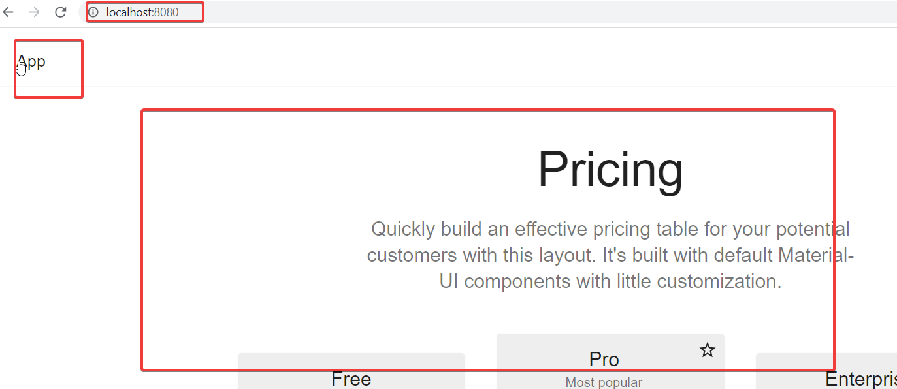
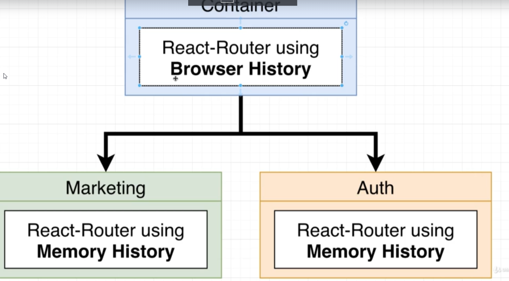
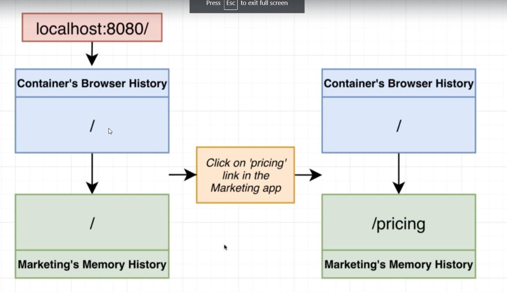

Multi tier Navigation

Routing issue
when clicked on App, it doesnot load homepage


# History Implementation



Use browserHistory for container(parent)
( i.e  BrowserRouter)

& MemoryHistory for the childrens
(i.e Router)

# Memory History Implementation

1. update App.jsx
```js
import { Switch, Router, Route } from "react-router-dom";
//accepts history as props
export default ({history}) => {
  return (
    <div>
      <StylesProvider generateClassName={generateClassName}>
      //added  
	  <Router history={history}>
          <Switch>
              <Route exact path="/pricing" component={Pricing}/>
```
2. Update bootstrap.js
```js
import {createMemoryHistory} from "history"

const mount = (el) =>{
    const history = createMemoryHistory();
    ReactDOM.render(
    <App history={history}/> ,el)
}

```

### Sync issue between Browser History & Memory History

After above integration , you may find that routing logic wont work properly as there is no proper synce between browser & memory History.
Example:



## Two way communication
marketing/bootstrap.js
```jsx
import React from "react";
import ReactDOM from "react-dom";
import App from "./App.jsx";
import { createMemoryHistory, createBrowserHistory } from "history";

const mount = (el, { onNavigate, defaultHistory }) => {
    //use browsererhistory in isolation(dev) otherwise use memoryhistory
  const history = defaultHistory || createMemoryHistory();
  if (onNavigate) {
    history.listen(onNavigate);
  }
  ReactDOM.render(<App history={history} />, el);

  return {
    onParentNavigate: ({ pathname: nextPathname }) => {
      const { pathname } = history.location;
      if (pathname !== nextPathname) {
        history.push(nextPathname);
      }
    },
  };
};

if (process.env.NODE_ENV === "development") {
  const devRoot = document.querySelector("#_marketing_dev_root");
  if (devRoot) {
    mount(devRoot, { defaultHistory: createBrowserHistory() });
  }
}

export { mount };
```


2. parent container
container/components/MarketingApp.jsx
```js
import React, { useEffect, useRef } from "react";
// marketing is configured in webpack
import { mount } from "marketing/MarketingApp";
import { useHistory } from "react-router-dom";

export default () => {
  // create reference
  const ref = useRef(null);
  const history = useHistory();

  // implement logic to mount the MicrofrontEnd when DOM is loaded
  useEffect(() => {
    // call mount while passing the element 
    const { onParentNavigate } = mount(ref.current, {
      // destructioring window.location
      onNavigate: ({ pathname: nextPathname }) => {
        const { pathname } = history.location;
        if (pathname !== nextPathname) {
          history.push(nextPathname);
        }
      },
    });
    //listen to the path changes
    if (onParentNavigate) {
      history.listen(onParentNavigate);
    }
  }, []);

  return <div ref={ref}></div>;
};

```